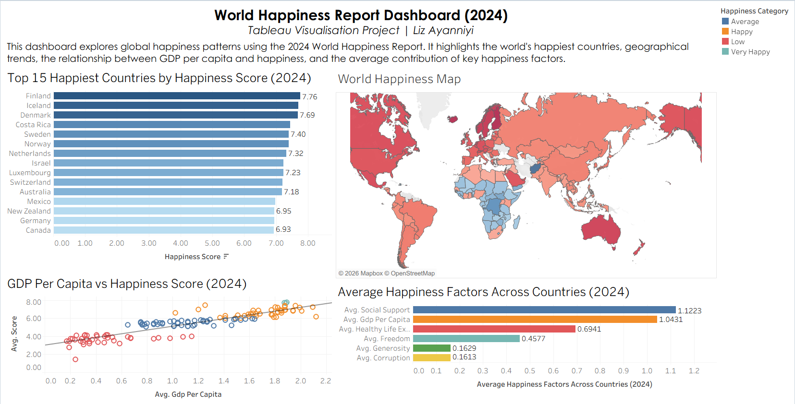
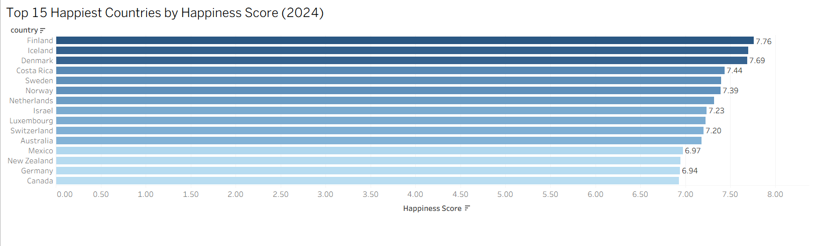
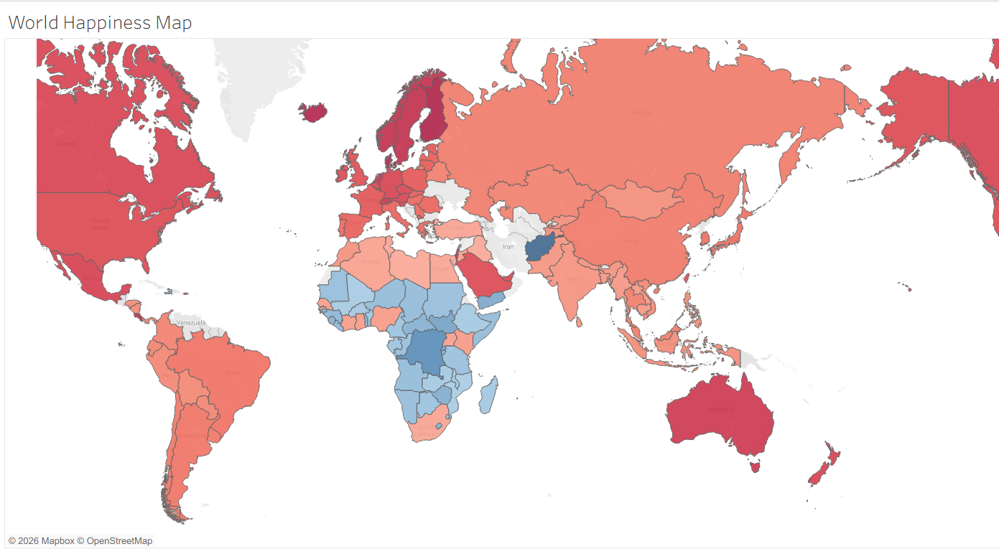
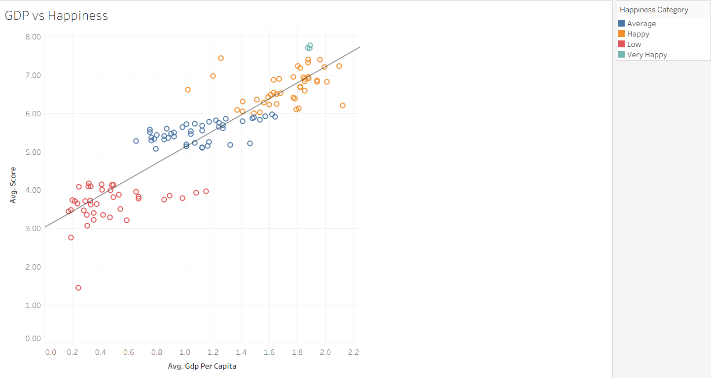
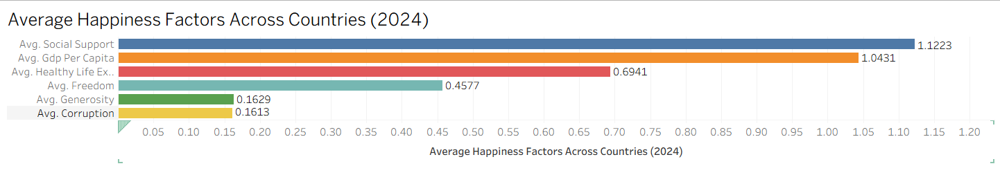

# World Happiness Report Analysis (Tableau)

A Tableau analysis of the 2024 World Happiness Report, featuring country rankings, a global happiness map, GDP correlation analysis and a dashboard of key happiness factors.

---

# 📖 Project Overview

This project explores the 2024 World Happiness Report using Tableau. The aim was to transform raw data into interactive visualisations that communicate key insights into global happiness, economic factors, and wellbeing.

The project demonstrates my ability to create dashboards, analyse relationships within data, and present findings through effective data visualisation.

---

## 📊 Dashboard Preview

---

# 🎯 Project Objectives

The objectives of this project were to:

- Create interactive Tableau visualisations.
- Explore global happiness trends by country.
- Analyse the relationship between GDP per capita and happiness.
- Build a professional dashboard suitable for business reporting.

---

# 📂 Dataset Description

Dataset: World Happiness Report (2024)

The dataset contains happiness scores and supporting indicators for countries around the world.

Key variables include:

- 147 Countries
- Happiness Score
- GDP Per Capita
- Social Support
- Healthy Life Expectancy
- Freedom
- Generosity
- Corruption

---

# 🛠 Tools Used

- Microsoft Excel
- Tableau

---

# 🔍 Analysis Process

### 1. Data Preparation

- Cleaned the dataset in Excel.
- Removed summary calculations used in previous analysis.
- Prepared a Tableau-ready dataset.

### 2. Data Exploration

- Analysed country happiness rankings.
- Explored geographical patterns.
- Compared key wellbeing indicators.

### 3. Visualisation

Created:

- Top 15 Happiest Countries
- World Happiness Map
- GDP vs Happiness Scatter Plot
- Happiness Factors Comparison
- Interactive Dashboard

### 4. Dashboard Design

Combined all visualisations into a single dashboard to present key findings in a clear and structured layout.

---

# 💡 Key Findings

- Nordic countries ranked among the happiest in the world.
- Countries with higher GDP per capita generally reported higher happiness scores.
- Social Support was the strongest contributing factor on average.
- Happiness levels varied considerably across different world regions.

---

# 💻 Skills Demonstrated

- Tableau Dashboard Design
- Data Visualisation
- Geographic Mapping
- Scatter Plot Analysis
- Trend Line Analysis
- Dashboard Layout
- Data Preparation
- Insight Communication

---

# 📸 Project Screenshots

## Dashboard Overview

---

## Top 15 Happiest Countries

---

## World Happiness Map

---

## GDP Per Capita vs Happiness Score

---

## Average Happiness Factors Comparison

---

# 🚀 Future Improvements

Possible future enhancements include:

- Add interactive filters for regions and continents.
- Create year-on-year comparisons using historical data.
- Include additional socioeconomic indicators.
- Publish the dashboard on Tableau Public.

---

# 👩🏾‍💼 About Me

Hi, I'm **Liz Ayanniyi**.

I'm a Business Analyst with a background in operations, process improvement and project delivery, currently expanding my technical skills through the Leep Data Technician Bootcamp.

This portfolio showcases projects completed using Excel, SQL, Tableau, Power BI and Python.

---

# 📬 Connect With Me

- LinkedIn:
- GitHub:
- Portfolio:
